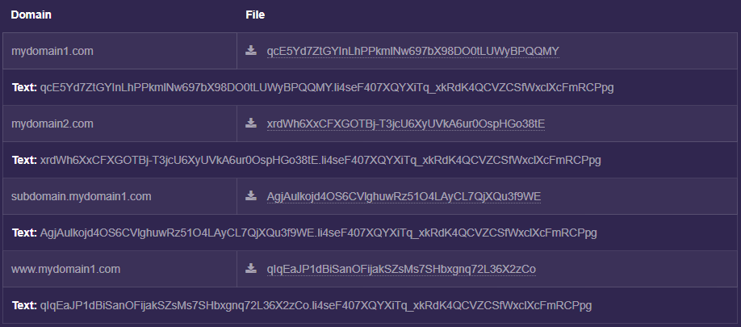
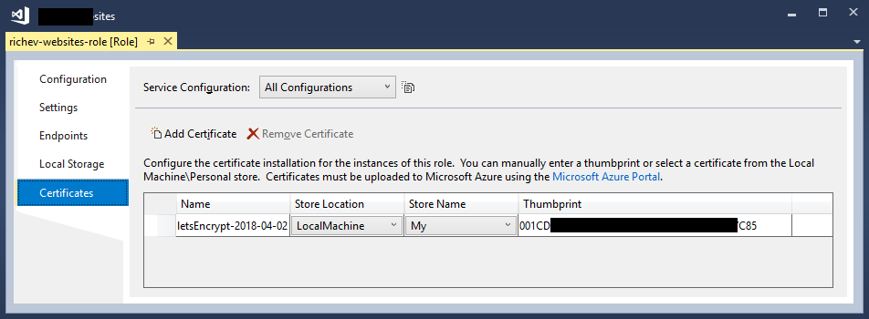
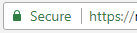

# Preamble

This document aims to explain how to use [ZeroSSL](https://zerossl.com/) to obtain and set up a free SSL certificate from [Let's Encrypt](https://letsencrypt.org/) for use with a website hosted on a [Microsoft Azure](https://azure.microsoft.com) [Cloud Service (classic)](https://azure.microsoft.com/en-gb/services/cloud-services/).

This may be useful to you if:

* You're a developer
* You maintain one or more websites
* You'd like them to [have](https://www.troyhunt.com/ssl-is-not-about-encryption/) [the benefits](https://mashable.com/2011/05/31/https-web-security) [of HTTPS](https://developers.google.com/web/fundamentals/security/encrypt-in-transit/why-https)
* But, you don't want to spend any money on an SSL certificate

And also if:

* You use Microsoft Windows
* Your websites are written in [ASP.NET MVC](https://www.asp.net/mvc)
* Your websites are hosted in Microsoft Azure using a Cloud Service (classic)

And lastly, if:

* You have a spare 30 minutes or so and some patience

> :information_source: SSL certificates from Let's Encrypt are only [valid for ninety days](https://letsencrypt.org/2015/11/09/why-90-days.html), so a subset of these steps has to be repeated when (or just before!) the certificate expires. Ideally you should have a mechanism in place for automatically renewing the certificate, but as yet I've not been able to figure out how to do this when using a Cloud Service.

> :warning: A Microsoft Azure _Cloud Service_ is different to a _Web App_. If you're using a Web App then this guide probably isn't for you as there is a [Let's Encrypt Site Extension](http://www.siteextensions.net/packages/letsencrypt) that should give you what you need for less work.

---

:thumbsup: OK, so, here goes...

# Pre-requisite Steps

> These only have to be done once.

## Website Setup - ACME Protocol

Let's Encrypt grants SSL certificates only for domains that we control. This is checked through a process known as **Verification**.

Verification is done via the [ACME Protocol](https://en.wikipedia.org/wiki/Automated_Certificate_Management_Environment). For lots more information, see [How It Works](https://letsencrypt.org/how-it-works/).

During the Verification process, Let's Encrypt will visit a URL of the form

```
http://mydomain.com/.well-known/acme-challenge/<challenge>
```

on our website(s), at which they expect to see a specific `response`. The `<challenge>` value is unique for each domain (and subdomain), and changes each time we go through Verification.

> The `<challenge>` and `response` values for our domain(s) will be given to us later on in the process

To support this, we can add a controller that contains two endpoints:
*  A `GET` endpoint (with suitable routing) that will respond to `.well-known/acme-challenge/<challenge>` requests
*  A `POST` endpoint that allows us to set up the `<challenge>` and `response` values

> This is for an ASP.NET MVC website that uses the .NET Framework. It should be easy to adapt it for .NET Core

```csharp
using System.Collections.Generic;
using System.Web.Mvc;

namespace Richev.Examples
{
    [RoutePrefix(".well-known")]
    public class LetsEncryptController : Controller
    {
        /// <summary>
        /// A GUID that should be kept secret, that needs to be known in order to POST a challenge response.
        /// A sort of poor-man's authentication mechanism.
        /// </summary>
        private static readonly Guid _secret = Guid.Parse("TODO: replace this with a GUID that you generate");

        /// <summary>
        /// The endpoint that Let's Encrypt will call when verifying domain ownership.
        /// </summary>
        [Route("acme-challenge/{challenge}")]
        [HttpGet]
        public virtual ActionResult Index(string challenge)
        {
            var response = (string)HttpContext.Cache[challenge];

            if (string.IsNullOrEmpty(response))
            {
                return HttpNotFound();
            }
            
            return Content(response);
        }

        /// <summary>
        /// An endpoint that allows you to upload each of the Let's Encrypt challenge strings,
        /// and their respective expected responses.
        /// See below for an example PowerShell script for doing this.
        /// </summary>
        [HttpPost]
        public ActionResult ChallengeResponse(ChallengeResponseModel challengeResponse)
        {
            if (!challengeResponse.IsValid(_secret))
            {
                return new HttpStatusCodeResult(HttpStatusCode.BadRequest);
            }

            HttpContext.Cache.Add(
                challengeResponse.Challenge,
                challengeResponse.Response,
                null,
                DateTime.Now.AddHours(1),
                Cache.NoSlidingExpiration,
                CacheItemPriority.Default,
                null);

            return Content($"Added '{challengeResponse.Challenge}' to cache.");
        }
    }

    public sealed class ChallengeResponseModel
    {
        private const int UnexpectedlyLongString = 500;

        public Guid? Secret { get; set; }

        public string Challenge { get; set; }

        public string Response { get; set; }

        public bool IsValid(Guid secret)
        {
            return !string.IsNullOrWhiteSpace(Challenge) &&
                   !string.IsNullOrWhiteSpace(Response) &&
                   Challenge.Length < UnexpectedlyLongString &&
                   Response.Length < UnexpectedlyLongString &&
                   Secret.HasValue &&
                   Secret.Value == secret;
        }
    }
}
```

In order for the [routing](https://www.asp.net/mvc/overview/controllers-and-routing) to work, add `routes.MapMvcAttributeRoutes()` in your `RouteConfig`.

```csharp
public class RouteConfig
{
    public static void RegisterRoutes(RouteCollection routes)
    {
        routes.IgnoreRoute("{resource}.axd/{*pathInfo}");

        routes.MapMvcAttributeRoutes(); // here!

        // ...etc
    }
}
```

> :thought_balloon: After adding this controller to your website, be sure to redeploy and test that the endpoints are working by POSTing a dummy `<challenge>` and `response` and seeing that you can GET them. You can perform the POST using a tool such as [Postman](https://www.getpostman.com/), or using a PowerShell script like the one listed later on in this document.

## Website Setup - Bonus Step - Forcing HTTPS

Configuring an SSL certificate for HTTPS is great, but of limited benefit if your existing users continue to arrive at your website(s) using HTTP. So, it seems appropriate to redirect any requests that use HTTP over to HTTPS.

There are [various ways](https://stackoverflow.com/questions/4945883/how-to-redirect-http-to-https-in-mvc-application-iis7-5) to achieve this in ASP.NET MVC, but I chose to create an attribute that inherits from  [`RequiresHttpsAttribute`](https://msdn.microsoft.com/en-us/library/system.web.mvc.requirehttpsattribute(v=vs.118).aspx), that redirects _unless_ the host is `localhost`. Simple to use, and doesn't get in the way when testing on locally.

```csharp
using System.Web.Mvc;

namespace Richev.Common.Web.Attributes
{
    public class RequireHttpsUnlessLocalhostAttribute : RequireHttpsAttribute
    {
        protected override void HandleNonHttpsRequest(AuthorizationContext filterContext)
        {
            if (!filterContext.HttpContext.Request.Url.Host.Contains("localhost"))
            {
                base.HandleNonHttpsRequest(filterContext);
            }
        }
    }
}
```

Add this attribute to all of the controllers where you want to enforce HTTPS

## PC Setup - OpenSSL

Later on, we'll have our shiny new SSL certificate and private key. But, to get the certificate file we'll actually use, we will need to add the private key to the certificate. We'll do this using [OpenSSL](https://www.openssl.org/), so you need to have that installed on your PC.

Windows installers for OpenSSL are maintained by [Shining Light Productions](https://slproweb.com/products/Win32OpenSSL.html). You'll probably need the [64-bit 'light' installer](https://slproweb.com/download/Win64OpenSSL_Light-1_1_0h.exe). Download and install it.

---

> :thumbsup: Now that the pre-requisites are done, we can really get started...

# Obtaining the SSL Certificate and Private Key

We're going to use [ZeroSSL](https://zerossl.com/), which will take us through three steps.

### Details :arrow_forward: Verification :arrow_forward: Certificate

## 1. Details

Point your browser to https://zerossl.com/free-ssl/#crt and fill in your details

### Email
This is optional, but you can set it to receive certificate expiration reminder emails.

### Domains
A list of the domains (and relevant sub-domains) for which you want the certificate to be valid for. For example:

```
mydomain1.com www.mydomain1.com subdomain.mydomain1.com mydomain2.com
```

> Wildcard domains (e.g. `*.example.com`) won't work here :disappointed:

* Accept the ZeroSSL TOS and Let's Encrypt SA and hit _Next_
* Download the _Certificate Request_ (`domain-csr.txt`) and save it somewhere
* Hit _Next_
* Download the _Account Key_ (`account-key.txt`) and save it somewhere.
* Hit _Next_

> :thought_balloon: We won't need the _Certificate Request_ and _Account Key_ again today, **but you'll use them next time when you want to renew your expired certificate**.

## 2. Verification

The ZeroSSL website now shows us the expected `challenge`s (labelled as **File**) and `response`s (labelled as **Text**).



We need to set up our website(s) to return these expected responses, which we can do using the following PowerShell script.

```powershell
$challengeResponses = (
    # TODO: Update this list with your domain(s), along with the challenge and response strings
    ("mydomain1.com", "challenge1", "challenge1.response"),
    ("www.mydomain1.com", "challenge2", "challenge2.response"),
    ("subdomain.mydomain1.com", "challenge3", "challenge3.response"),
    ("mydomain2.com", "challenge4", "challenge4.response")
)

$secret = "TODO: put your secret GUID here - the one you set in your LetsEncryptController"

foreach ($challengeResponse in $challengeResponses)
{
    $uri = "http://$($challengeResponse[0])/LetsEncrypt/ChallengeResponse"
    $body = "{secret: '$secret', challenge: '$($challengeResponse[1])', response: '$($challengeResponse[2])'}"

    Invoke-WebRequest -Uri $uri -Method POST -ContentType "application/json" -Body $body | Format-List -Property Content
}
```

One this is done, hit **Next** and wait a few seconds for ZeroSSL and Let's Encrypt to verify your domain(s).

## 3. Certificate

If everything went well, ZeroSSL now presents us with two files.

* `domain-crt.txt` the certificate
* `domain-key.txt` the private key

Download them and save them somewhere, ready for the next step.

# Adding the Private Key

We'll use OpenSSL to add the private key to the certificate.

At the command-line, run the following commands (from the folder where you saved `domain-crt.txt` and `domain-key.txt`) to generate a new file (`has-private-key.pfx` in the example below), that contains the private key:

```
set path="C:\Program Files\OpenSSL-Win32\bin"
openssl pkcs12 -export -in domain-crt.txt -inkey domain-key.txt -out has-private-key.pfx
```

> :thought_balloon: You'll be prompted to _Enter Export Password_ so do this and **remember the password**, as you'll need it when uploading the certificate to the Microsoft Azure Portal in the next step.

# Using the Certificate
We need to do three things with this certificate (`has-private-key.pfx`)

1. Upload it to the Microsoft Azure Portal
2. Add it to the Windows Certificate Store
3. Refer to it in our Azure Cloud Service configuration

> There may well be different/better ways of doing this, in particular step 2...

## 1. Microsoft Azure Portal

Starting at https://portal.azure.com

* Select _Cloud Services (classic)_
* Select your Cloud Service
* Under _Settings_, select _Certificates_ then hit _Upload_

You will then be prompted to upload a certificate, so upload the one containing the private key (`has-private-key.pfx`) and when prompted enter the export password you used previously.

> :thought_balloon: Once the certificate has uploaded, note down the _thumbprint_, as you'll need this in step 3.

## 2. Windows Certificate Store

The certificate needs to be added to your PC's Windows Certificate Store, so that Visual Studio can reference it. This is explained in a series of detailed steps over at [Technet](https://technet.microsoft.com/en-au/library/cc995171.aspx).

## 3. Azure Cloud Service

In Visual Studio, right-click your Cloud Service configuration, and add your certificate as illustrated below, using the thumbprint you noted down in step 1.



In your `ServiceDefinition.csdef` file, add HTTPS endpoints for all of the domains that the certificate is valid for. It should end up looking something like this.

```xml
<?xml version="1.0" encoding="utf-8"?>
<ServiceDefinition name="MyWebsites" xmlns="http://schemas.microsoft.com/ServiceHosting/2008/10/ServiceDefinition" schemaVersion="2015-04.2.6">
  <WebRole name="my-websites-role" vmsize="ExtraSmall">
    <Sites>
      <Site name="first-site" physicalDirectory="..\..\..\Richev.Example">
        <VirtualApplication name="portfolio-application" physicalDirectory="..\..\..\Richev.Example" />
        <Bindings>
          <Binding name="Endpoint1" endpointName="Endpoint1" hostHeader="mydomain1.com" />
          <Binding name="Endpoint1" endpointName="Endpoint1" hostHeader="www.mydomain1.com" />
          <Binding name="httpsEndpoint" endpointName="httpsEndpoint" hostHeader="subdomain.mydomain1.com" />
          <Binding name="httpsEndpoint" endpointName="httpsEndpoint" hostHeader="mydomain2.com" />
        </Bindings>
      </Site>
    </Sites>
    <Endpoints>
      <InputEndpoint name="Endpoint1" protocol="http" port="80" />
      <InputEndpoint name="httpsEndpoint" protocol="https" port="443" certificate="letsEncrypt-2018-04-02" />
    </Endpoints>
    <Imports>
    </Imports>
    <Certificates>
      <Certificate name="letsEncrypt-2018-04-02" storeLocation="LocalMachine" storeName="My" />
    </Certificates>
  </WebRole>
</ServiceDefinition>
```

# Finally

Publish your website(s) again, and you should now be able to navigate to them using HTTPS.

:tada: You should see a green padlock icon and (in Google Chrome) the reassuring word 'Secure'.



# Next Time

At https://zerossl.com/free-ssl/#crt, start off by pasting the _Account Key_ (`account-key.txt`) into the left-hand input field, and the  _Certificate Request_ file (`domain-csr.txt`) into the right-hand input field. Then continue as before.

# Troubleshooting

## HTTP 503 error
If you get an HTTP 503 error page when navigating to your website using HTTPS this may be because the HTTPS endpoint binding isn't set up correctly in your `ServiceDefinition.csdef`.